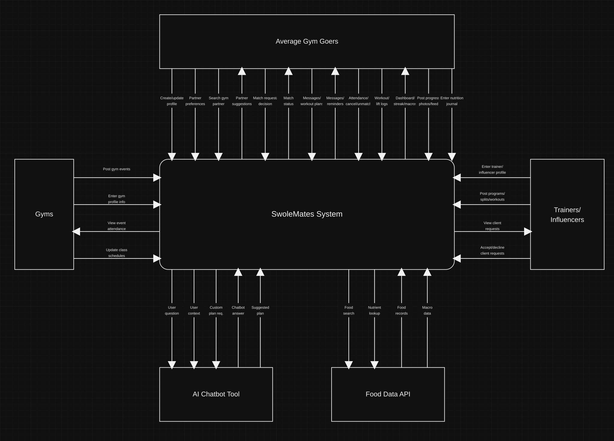

# SwoleMates system context diagram

This Level-0 context diagram keeps each external entity outside the SwoleMates system boundary and shows exactly 30 one-way data flows. Recipe discovery, recipe publishing, and recipe video generation are excluded. The Nutrition Data API remains only for food journaling and macro totals.

- [Editable SVG](diagrams/swolemates-context-diagram.svg)
- [High-resolution PNG](diagrams/swolemates-context-diagram.png)

## Interaction inventory

| # | External entity | Direction | Data flow |
|---:|---|---|---|
| 1 | Average Gym Goers | To SwoleMates | Create or update profile |
| 2 | Average Gym Goers | To SwoleMates | Set partner preferences |
| 3 | Average Gym Goers | To SwoleMates | Search for gym partner |
| 4 | Average Gym Goers | From SwoleMates | Return partner suggestions |
| 5 | Average Gym Goers | To SwoleMates | Send match request or decision |
| 6 | Average Gym Goers | From SwoleMates | Return match status |
| 7 | Average Gym Goers | To SwoleMates | Send messages and workout plans |
| 8 | Average Gym Goers | From SwoleMates | Return messages and reminders |
| 9 | Average Gym Goers | To SwoleMates | Confirm attendance, cancel, or unmatch |
| 10 | Average Gym Goers | To SwoleMates | Log workouts and lifts |
| 11 | Average Gym Goers | From SwoleMates | View dashboard, streak, reliability, and macros |
| 12 | Average Gym Goers | To SwoleMates | Post progress photos and feed activity |
| 13 | Average Gym Goers | To SwoleMates | Enter nutrition journal |
| 14 | Gyms | To SwoleMates | Post gym events |
| 15 | Gyms | To SwoleMates | Enter gym profile info |
| 16 | Gyms | From SwoleMates | View event attendance |
| 17 | Gyms | To SwoleMates | Update class schedules |
| 18 | Trainers / Influencers | To SwoleMates | Enter trainer or influencer profile |
| 19 | Trainers / Influencers | To SwoleMates | Post programs, splits, and workouts |
| 20 | Trainers / Influencers | From SwoleMates | View client requests |
| 21 | Trainers / Influencers | To SwoleMates | Accept or decline client requests |
| 22 | AI Chatbot Tool | From SwoleMates | User question |
| 23 | AI Chatbot Tool | From SwoleMates | Relevant user context |
| 24 | AI Chatbot Tool | From SwoleMates | Custom plan request |
| 25 | AI Chatbot Tool | To SwoleMates | Chatbot answer |
| 26 | AI Chatbot Tool | To SwoleMates | Suggested workout plan |
| 27 | Food Data API | From SwoleMates | Food search request |
| 28 | Food Data API | From SwoleMates | Nutrient lookup request |
| 29 | Food Data API | To SwoleMates | Food records |
| 30 | Food Data API | To SwoleMates | Macro and nutrition data |

## Direction convention

- **To SwoleMates** means the external entity sends data into the system.
- **From SwoleMates** means the system sends data to the external entity.
- Every arrow is directional; a request and its response are counted as separate interactions.
