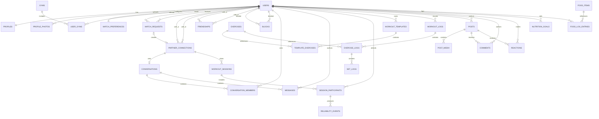

# Initial relational data model

## Diagram clarification

The supplied image is best described as a **system context/data-flow diagram**. It correctly identifies external actors and services—gym-goers, gyms, trainers/influencers, an AI service, and a food-data service—but it does not yet show database entities, primary/foreign keys, or relationship cardinalities. The model below is the initial ERD for the core product.

## Core ERD

## Entity responsibilities

### Identity and discovery

- `users`: account identity, lifecycle state, role, timestamps. Authentication secrets stay in the authentication provider.
- `profiles`: public/display fields and field-level visibility settings.
- `profile_photos`: ordered media objects with moderation state.
- `match_preferences`: distance, experience/strength ranges, and an `allow_outside_*` flag per supported range.
- `gyms`: public gym identity and approximate map position.
- `user_gyms`: many-to-many membership/preference link with `is_primary`.

Multi-value preferences such as genders, goals, workout styles, and availability windows should use child/join tables instead of comma-separated text.

### Relationships and communication

- `match_requests`: sender, recipient, message, status, expiration, and response timestamps.
- `partner_connections`: the accepted workout-partner relationship and its active/ended lifecycle.
- `friendships`: an independent mutual social relationship.
- `blocks`: directional safety relationship. A block overrides discovery, messaging, friendship, and partner state.
- `conversations`, `conversation_members`, `messages`: conversation membership and message history. Membership authorization must be checked for every read/write.

### Workout commitment and reliability

- `workout_sessions`: proposed/confirmed/canceled/completed plan, start/end time, gym or safe public location, and optional workout template.
- `session_participants`: each participant's invitation response, cancellation timestamp, and attendance claim.
- `reliability_events`: append-only, explainable events created only from eligible confirmed sessions.

The displayed reliability summary should be derived from events. Do not let clients directly write a score. Store a cached score snapshot only if performance later requires it.

### Personal training data

- `exercises`: canonical exercise catalog.
- `workout_templates` and `template_exercises`: reusable workout plans.
- `workout_logs`, `exercise_logs`, and `set_logs`: completed personal workouts and their set-level detail.

Personal records, streaks, and calendar activity can initially be calculated from completed logs rather than stored as independent sources of truth.

### Social data

- `posts`: author, audience, caption, optional shared workout, and moderation state.
- `post_media`: ordered photos/videos stored outside the database.
- `comments` and `reactions`: social engagement with uniqueness and authorization constraints.

### Nutrition journal

- `nutrition_goals`: dated calorie/macro targets and the calculation inputs used at that time.
- `food_items`: normalized internal or externally sourced food record with provider and provider item ID.
- `food_log_entries`: serving quantity, meal, date/time, and a nutrient snapshot so history does not change when provider data changes.

Dietary and allergen metadata from an external provider must be treated as informational rather than a medical guarantee.

## Important database constraints

- Store `user_a_id < user_b_id` on symmetric pair tables so a pair has only one active relationship.
- Reject self-match, self-friendship, and self-block records.
- Permit only one active match request per user pair and expire unanswered requests.
- Messages require active conversation membership; row-level authorization should be enforced in the database/backend.
- Store distances using geospatial queries, but return only rounded distance—not another user's coordinates.
- Preserve nutrition values and units on historical log entries.
- Use UTC timestamps in storage and retain the user's timezone for calendar/streak rendering.
- Soft-delete public content when moderation/audit history is required; hard-delete or anonymize personal data according to the deletion policy.
- Add uniqueness constraints for one reaction per user/post/type and one participant per user/session.

## Later-phase entities

Trainer and gym portals can add `trainer_profiles`, `trainer_verifications`, `training_programs`, `program_workouts`, `client_requests`, `gym_admins`, `gym_events`, `event_attendees`, and `class_schedules`. Keeping these out of the first migration reduces scope without blocking future expansion.
