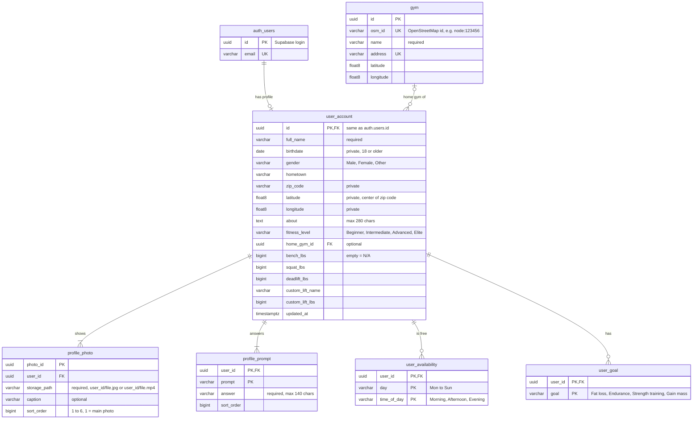
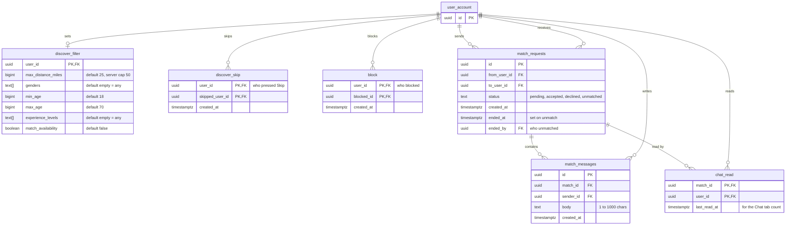
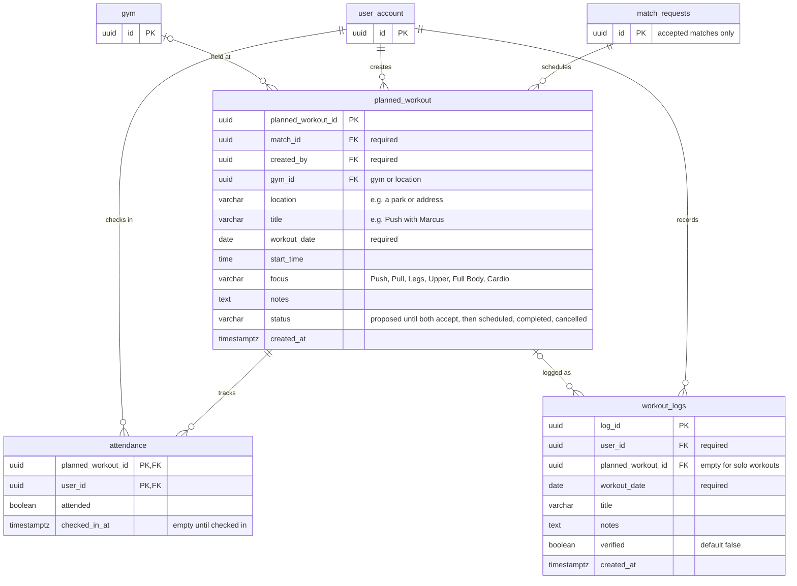
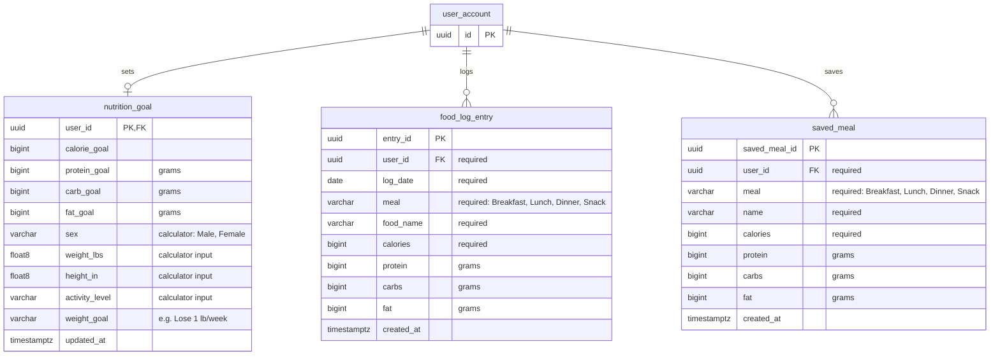
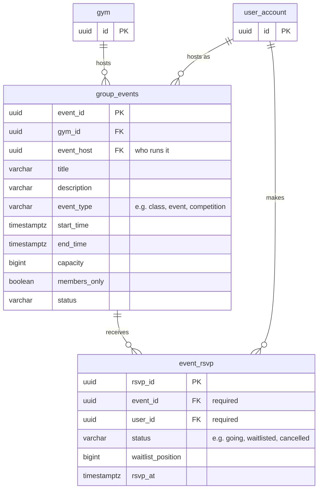
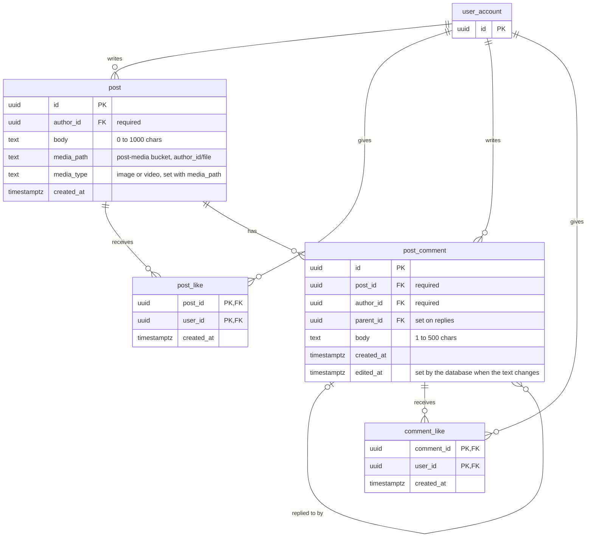
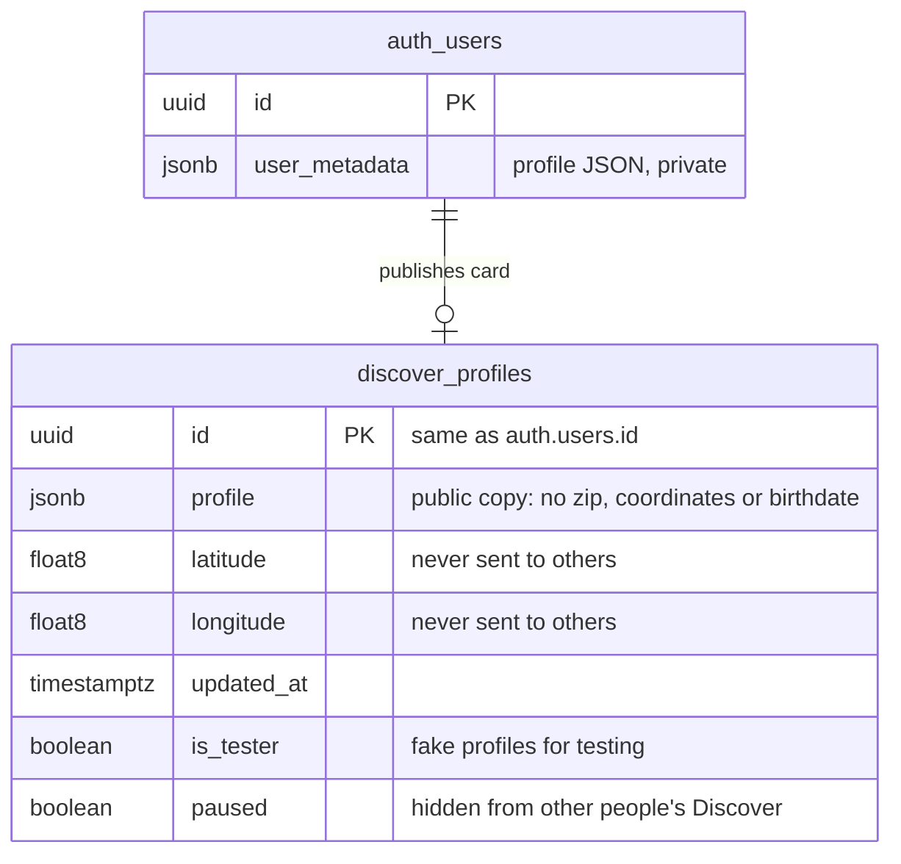

# SwoleMates database

This is the team's single reference for the Supabase database. It matches the tables in Supabase as of Sep 26, 2026. If this file and Supabase ever disagree, check Supabase and fix this file.

Interactive version with zoomable diagrams: https://claude.ai/artifact/GAoLFw9mZcUBjpbxxmpCQJ (ask Noor for access).

## Changing the database

1. Agree on the change with Noor, who owns the database.
2. Noor makes the change in Supabase, with RLS and a policy for any new table.
3. Update this file (`docs/DATA_MODEL.md`) in the same pull request as the code that uses the change.
4. Don't rename or remove a column that app code still reads until that code is changed.

## Tables

| Table | Area | Holds | Who can read and write | Used by the app yet |
|---|---|---|---|---|
| `user_account` | Profile | One row per person: name, birthdate, location, lifts | Your own row only | Saved on profile save |
| `gym` | Profile, Plans | Shared list of gyms | Anyone signed in can read and add; missing osm_id can be filled in | Saved on profile save |
| `profile_photo` | Profile | Up to 6 photos or clips with captions | Your own rows | Saved on profile save |
| `profile_prompt` | Profile | Prompt answers (3 or more) | Your own rows | Saved on profile save |
| `user_availability` | Profile, Discover | Free days × times of day | Your own rows | Saved on profile save |
| `user_goal` | Profile | Fitness goals | Your own rows | Saved on profile save |
| `discover_filter` | Discover | Discover filter settings | Your own row | Yes |
| `discover_skip` | Discover | Profiles you skipped | Your own rows | Yes |
| `block` | Discover, Chat | People you blocked | Your own rows | Yes |
| `report` | Chat | Why you reported someone, plus an explanation | You can file and read your own reports | Yes |
| `match_requests` | Discover, Chat | Requests and matches, including unmatches | The two people involved; rules for accept, decline, cancel and unmatch | Yes |
| `match_messages` | Chat | Chat messages | The two people in an accepted match | Yes |
| `chat_read` | Chat | When you last read each chat | Your own rows | Not yet (stored on the device) |
| `planned_workout` | Plans | Workouts planned with a match | Both people in the accepted match | Yes |
| `attendance` | Plans | Who showed up | Both people can read; you check yourself in | Not yet |
| `workout_logs` | Dashboard | Every workout, solo or planned | Your own rows | Not yet |
| `nutrition_goal` | Nutrition | Daily targets and calculator inputs | Your own row | Not yet |
| `food_log_entry` | Nutrition | Food eaten, by day and meal | Your own rows | Not yet |
| `saved_meal` | Nutrition | Reusable meals | Your own rows | Not yet |
| `group_events` | Gym events | Classes and events at gyms | Anyone signed in can read; the host manages theirs | Not yet |
| `event_rsvp` | Gym events | RSVPs and waitlist | Your own rows | Not yet |
| `post` | Social | Posts, with an optional photo or clip | You and your matches can read; you write and delete your own | Waiting for Noor to run `supabase/social.sql` |
| `post_like` | Social | Who liked each post | Anyone who can see the post; you add and remove your own | Waiting for Noor |
| `post_comment` | Social | Comments and one level of replies | Anyone who can see the post; you edit your own; you or the post's author can delete | Waiting for Noor |
| `comment_like` | Social | Who liked each comment | Anyone who can see the comment; you add and remove your own | Waiting for Noor |
| `discover_profiles` | Discover | Old public profile copy | Your own row; others through discover_people() | Yes, remove later |

## Accounts & profiles

*Profile tab.* One `user_account` row per person, using the same ID as their Supabase login (`auth.users`). Anything a person can have several of gets its own table. A profile has 1–6 photos or clips (the files are in the `profile-photos` storage bucket, each under 50MB, and `storage_path` points to them; a `.mp4` or `.mov` path is a clip) and at least 3 prompt answers. Lifts are in pounds, and an empty value means N/A. Gyms are shared: two people at the same gym point to one `gym` row, matched by OpenStreetMap ID.

```mermaid
erDiagram
  auth_users {
    uuid id PK "Supabase login"
    varchar email UK
  }
  user_account {
    uuid id PK, FK "same as auth.users.id"
    varchar full_name "required"
    date birthdate "private, 18 or older"
    varchar gender "Male, Female, Other"
    varchar hometown
    varchar zip_code "private"
    float8 latitude "private, center of zip code"
    float8 longitude "private"
    text about "max 280 chars"
    varchar fitness_level "Beginner, Intermediate, Advanced, Elite"
    uuid home_gym_id FK "optional"
    bigint bench_lbs "empty = N/A"
    bigint squat_lbs
    bigint deadlift_lbs
    varchar custom_lift_name
    bigint custom_lift_lbs
    timestamptz updated_at
  }
  gym {
    uuid id PK
    varchar osm_id UK "OpenStreetMap id, e.g. node:123456"
    varchar name "required"
    varchar address UK
    float8 latitude
    float8 longitude
  }
  profile_photo {
    uuid photo_id PK
    uuid user_id FK
    varchar storage_path "required, user_id/file.jpg or user_id/file.mp4"
    varchar caption "optional"
    bigint sort_order "1 to 6, 1 = main photo"
  }
  profile_prompt {
    uuid user_id PK, FK
    varchar prompt PK
    varchar answer "required, max 140 chars"
    bigint sort_order
  }
  user_availability {
    uuid user_id PK, FK
    varchar day PK "Mon to Sun"
    varchar time_of_day PK "Morning, Afternoon, Evening"
  }
  user_goal {
    uuid user_id PK, FK
    varchar goal PK "Fat loss, Endurance, Strength training, Gain mass"
  }
  auth_users ||--o| user_account : "has profile"
  gym |o--o{ user_account : "home gym of"
  user_account ||--|{ profile_photo : shows
  user_account ||--|{ profile_prompt : answers
  user_account ||--o{ user_availability : "is free"
  user_account ||--o{ user_goal : has
```

## Discover, matching & chat

*Discover and Chat tabs.* A match starts as a request. Accepting it opens a chat; only the two people in an accepted match can read or send its messages. Unmatching sets the status to `unmatched` and records when and who; the chat is hidden, and either person can send a new request later, which reuses the same row so the old chat comes back once accepted. `discover_skip` and `block` keep people off your Discover deck.

```mermaid
erDiagram
  user_account {
    uuid id PK
  }
  discover_filter {
    uuid user_id PK, FK
    bigint max_distance_miles "default 25, server cap 50"
    text[] genders "default empty = any"
    bigint min_age "default 18"
    bigint max_age "default 70"
    text[] experience_levels "default empty = any"
    boolean match_availability "default false"
  }
  discover_skip {
    uuid user_id PK, FK "who pressed Skip"
    uuid skipped_user_id PK, FK
    timestamptz created_at
  }
  block {
    uuid user_id PK, FK "who blocked"
    uuid blocked_id PK, FK
    timestamptz created_at
  }
  match_requests {
    uuid id PK
    uuid from_user_id FK
    uuid to_user_id FK
    text status "pending, accepted, declined, unmatched"
    timestamptz created_at
    timestamptz ended_at "set on unmatch"
    uuid ended_by FK "who unmatched"
  }
  match_messages {
    uuid id PK
    uuid match_id FK
    uuid sender_id FK
    text body "1 to 1000 chars"
    timestamptz created_at
  }
  chat_read {
    uuid match_id PK, FK
    uuid user_id PK, FK
    timestamptz last_read_at "for the Chat tab count"
  }
  user_account ||--o| discover_filter : sets
  user_account ||--o{ discover_skip : skips
  user_account ||--o{ block : blocks
  user_account ||--o{ match_requests : sends
  user_account ||--o{ match_requests : receives
  match_requests ||--o{ match_messages : contains
  user_account ||--o{ match_messages : writes
  match_requests ||--o{ chat_read : "read by"
  user_account ||--o{ chat_read : reads
```

## Plans & workout logs

*Plans and Dashboard tabs.* A planned workout belongs to an accepted match, and either person in it can see and edit it. A chat request starts as `proposed`, with `notes` holding `{"acceptedBy":[...]}`. It becomes `scheduled` only after both people have accepted. It happens at a gym (`gym_id`) or somewhere else (`location`), never both. Each person checks themselves in through `attendance`. `workout_logs` holds every workout: solo ones you log yourself (`verified` false, no plan) and completed plans (`verified` true, linked to the plan), one log per person per plan. The streak and calendar are counted from `workout_logs`, so no table stores them.

```mermaid
erDiagram
  user_account {
    uuid id PK
  }
  match_requests {
    uuid id PK "accepted matches only"
  }
  gym {
    uuid id PK
  }
  planned_workout {
    uuid planned_workout_id PK
    uuid match_id FK "required"
    uuid created_by FK "required"
    uuid gym_id FK "gym or location"
    varchar location "e.g. a park or address"
    varchar title "e.g. Push with Marcus"
    date workout_date "required"
    time start_time
    varchar focus "Push, Pull, Legs, Upper, Full Body, Cardio"
    text notes
    varchar status "proposed until both accept, then scheduled, completed, cancelled"
    timestamptz created_at
  }
  attendance {
    uuid planned_workout_id PK, FK
    uuid user_id PK, FK
    boolean attended
    timestamptz checked_in_at "empty until checked in"
  }
  workout_logs {
    uuid log_id PK
    uuid user_id FK "required"
    uuid planned_workout_id FK "empty for solo workouts"
    date workout_date "required"
    varchar title
    text notes
    boolean verified "default false"
    timestamptz created_at
  }
  match_requests ||--o{ planned_workout : schedules
  user_account ||--o{ planned_workout : creates
  gym |o--o{ planned_workout : "held at"
  planned_workout ||--o{ attendance : tracks
  user_account ||--o{ attendance : "checks in"
  user_account ||--o{ workout_logs : records
  planned_workout |o--o{ workout_logs : "logged as"
```

## Nutrition

*Dashboard → Nutrition tracker.* From Gio's calorie tracker. Each food you eat is a `food_log_entry`, and a day's calories and macros are the sum of that day's entries. A `saved_meal` is a reusable shortcut: logging it copies its values into a new entry, so there's no link between the two tables. `nutrition_goal` holds the daily targets and, when the goal calculator is used, its inputs. The calculator's age comes from `user_account.birthdate`.

```mermaid
erDiagram
  user_account {
    uuid id PK
  }
  nutrition_goal {
    uuid user_id PK, FK
    bigint calorie_goal
    bigint protein_goal "grams"
    bigint carb_goal "grams"
    bigint fat_goal "grams"
    varchar sex "calculator: Male, Female"
    float8 weight_lbs "calculator input"
    float8 height_in "calculator input"
    varchar activity_level "calculator input"
    varchar weight_goal "e.g. Lose 1 lb/week"
    timestamptz updated_at
  }
  food_log_entry {
    uuid entry_id PK
    uuid user_id FK "required"
    date log_date "required"
    varchar meal "required: Breakfast, Lunch, Dinner, Snack"
    varchar food_name "required"
    bigint calories "required"
    bigint protein "grams"
    bigint carbs "grams"
    bigint fat "grams"
    timestamptz created_at
  }
  saved_meal {
    uuid saved_meal_id PK
    uuid user_id FK "required"
    varchar meal "required: Breakfast, Lunch, Dinner, Snack"
    varchar name "required"
    bigint calories "required"
    bigint protein "grams"
    bigint carbs "grams"
    bigint fat "grams"
    timestamptz created_at
  }
  user_account ||--o| nutrition_goal : sets
  user_account ||--o{ food_log_entry : logs
  user_account ||--o{ saved_meal : saves
```

## Gym events

*No screen yet.* Classes and events hosted at a gym. Anyone signed in can see events; only the host can change theirs. People RSVP through `event_rsvp`, whose status and waitlist position handle capacity.

```mermaid
erDiagram
  user_account {
    uuid id PK
  }
  gym {
    uuid id PK
  }
  group_events {
    uuid event_id PK
    uuid gym_id FK
    uuid event_host FK "who runs it"
    varchar title
    varchar description
    varchar event_type "e.g. class, event, competition"
    timestamptz start_time
    timestamptz end_time
    bigint capacity
    boolean members_only
    varchar status
  }
  event_rsvp {
    uuid rsvp_id PK
    uuid event_id FK "required"
    uuid user_id FK "required"
    varchar status "e.g. going, waitlisted, cancelled"
    bigint waitlist_position
    timestamptz rsvp_at
  }
  gym ||--o{ group_events : hosts
  user_account ||--o{ group_events : "hosts as"
  group_events ||--o{ event_rsvp : receives
  user_account ||--o{ event_rsvp : makes
```

## Social

*Social tab.* A feed of posts from you and the people you're matched with (an accepted `match_requests` row). Nobody else can see your posts, and a block in either direction hides them. Likes and comments can be seen by anyone who can see the post, so a match of the author can see comments from the author's other matches. `social_people()` supplies those commenters' names and main photos. Replies point at a top-level comment through `parent_id`, one level deep. Photos and clips are in the private `post-media` storage bucket under `<author id>/`, read through signed links that expire after an hour. Script: `supabase/social.sql`, waiting for Noor to run it.

```mermaid
erDiagram
  user_account {
    uuid id PK
  }
  post {
    uuid id PK
    uuid author_id FK "required"
    text body "0 to 1000 chars"
    text media_path "post-media bucket, author_id/file"
    text media_type "image or video, set with media_path"
    timestamptz created_at
  }
  post_like {
    uuid post_id PK, FK
    uuid user_id PK, FK
    timestamptz created_at
  }
  post_comment {
    uuid id PK
    uuid post_id FK "required"
    uuid author_id FK "required"
    uuid parent_id FK "set on replies"
    text body "1 to 500 chars"
    timestamptz created_at
    timestamptz edited_at "set by the database when the text changes"
  }
  comment_like {
    uuid comment_id PK, FK
    uuid user_id PK, FK
    timestamptz created_at
  }
  user_account ||--o{ post : writes
  post ||--o{ post_like : receives
  user_account ||--o{ post_like : gives
  post ||--o{ post_comment : has
  post_comment |o--o{ post_comment : "replied to by"
  user_account ||--o{ post_comment : writes
  post_comment ||--o{ comment_like : receives
  user_account ||--o{ comment_like : gives
```

## Old profile copies (remove later)

*Used by Discover today.* Zub's original setup, still used by the app while the screens move to the tables above. The full profile is also saved as JSON on the login account (`auth.users.user_metadata.profile`), and a public copy goes into `discover_profiles`, which `discover_people()` reads for Discover. Once Discover and the Profile screen read `user_account`, both copies can go.

```mermaid
erDiagram
  auth_users {
    uuid id PK
    jsonb user_metadata "profile JSON, private"
  }
  discover_profiles {
    uuid id PK "same as auth.users.id"
    jsonb profile "public copy: no zip, coordinates or birthdate"
    float8 latitude "never sent to others"
    float8 longitude "never sent to others"
    timestamptz updated_at
    boolean is_tester "fake profiles for testing"
    boolean paused "hidden from other people's Discover"
  }
  auth_users ||--o| discover_profiles : "publishes card"
```

## Rules the database enforces

- `user_account`: birthdate must be 18 or older (`user_account_age_18_plus`).
- `gym`: `address` and `osm_id` are each unique.
- `match_requests`: no request to yourself, one request per direction (`match_requests_pair_key`), status is one of pending, accepted, declined, unmatched.
- `report`: you can't report yourself. `block` only records who was blocked, so the reason and explanation live on `report`.
- `match_messages`: body is 1–1000 characters, and messages only work in accepted matches.
- `planned_workout`: exactly one of `gym_id` or `location` is filled in (`planned_workout_place_check`).
- `workout_logs`: one log per person per planned workout (`workout_logs_one_per_plan`).
- `food_log_entry` and `saved_meal`: meal is Breakfast, Lunch, Dinner or Snack.
- `post`: needs text or a photo or clip (`post_has_content`). `post_comment`: only the text can be edited, and a reply must point at a top-level comment on the same post. Deleting a post removes its likes and comments, and deleting a comment removes its replies.
- Link columns (`user_id`, `match_id`, `gym_id` and so on) have no default. Only a table's own ID column gets `gen_random_uuid()`, and `user_account.id` has none because it must equal the login ID.
- Every table has row-level security on. A new table needs RLS and at least one policy before the app can use it.

## Database functions

- `discover_people()`: Returns people within 50 miles with a rounded distance. Reads `discover_profiles` today. A paused profile stays saved and is left out of everyone else's results.
- `my_connections()`: Lists your requests and matches with the other person's card and last message.
- `send_match_request(to_user_id)`: Sends a request, accepts theirs if they already asked, and reopens declined or unmatched ones.
- `collapse_mutual_requests()`: Turns two requests between the same people into one match.
- `shares_posts_with(author)`: True for you, and for your matches when neither of you blocked the other. The Social read rules use it.
- `can_see_post(target_post)`: True when you can see that post.
- `social_people(people)`: Names and main photos for people in your feed: your matches, and anyone who commented on a post you can see.

## Not built yet

Trainers, programs and the AI chatbot are on hold while the team decides how they should work. They'll be added here when they're built.
