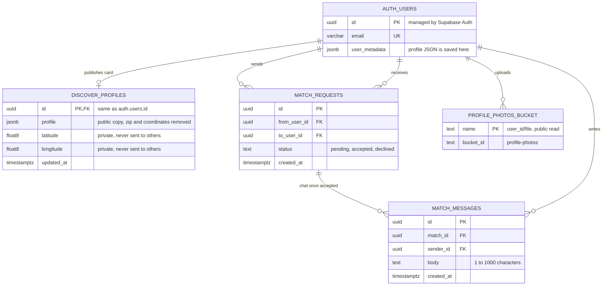
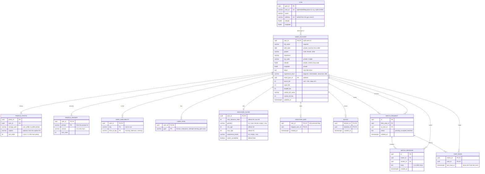
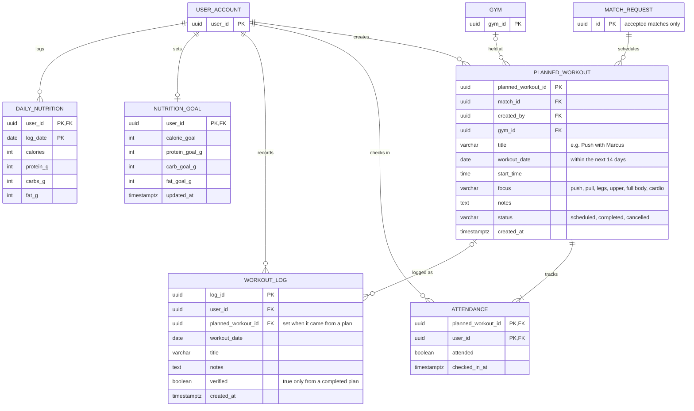
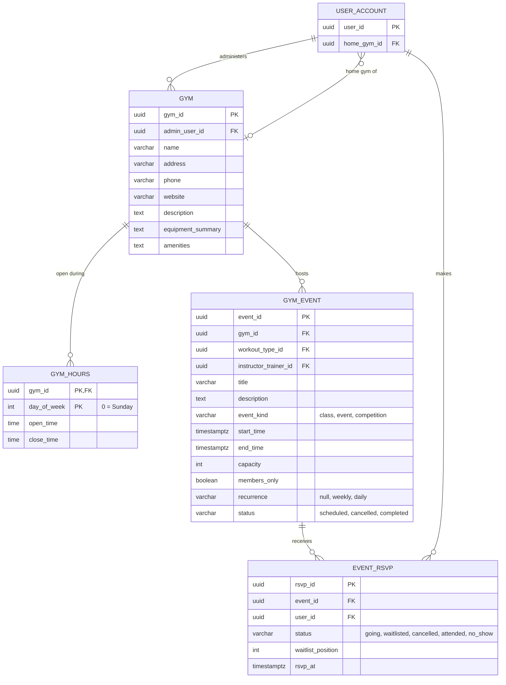
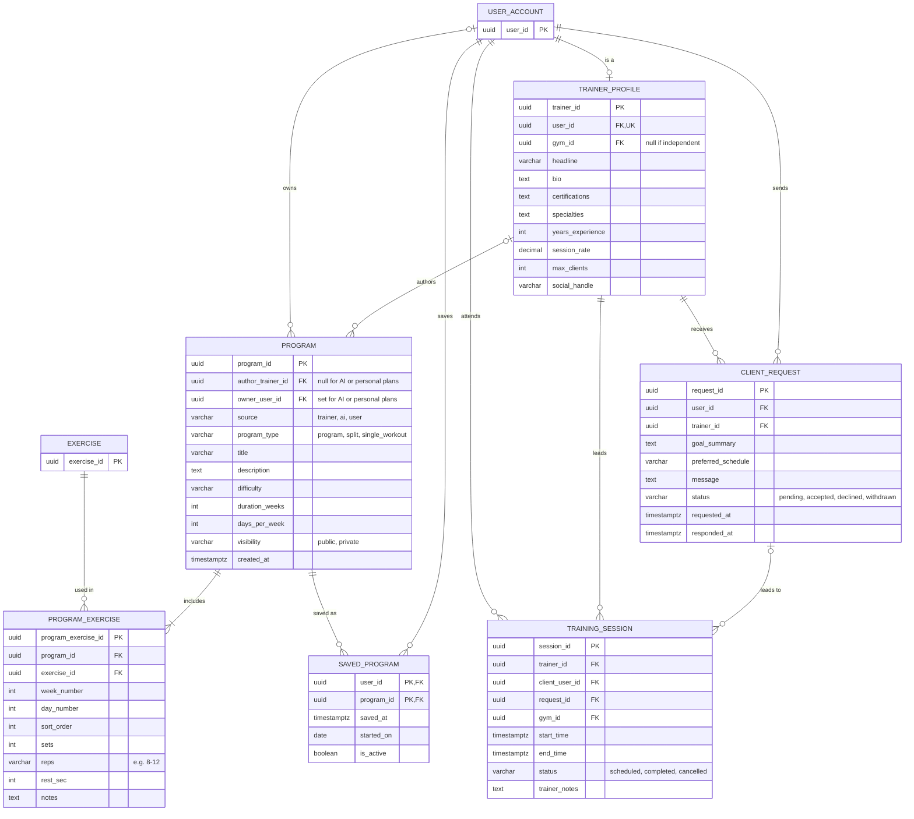
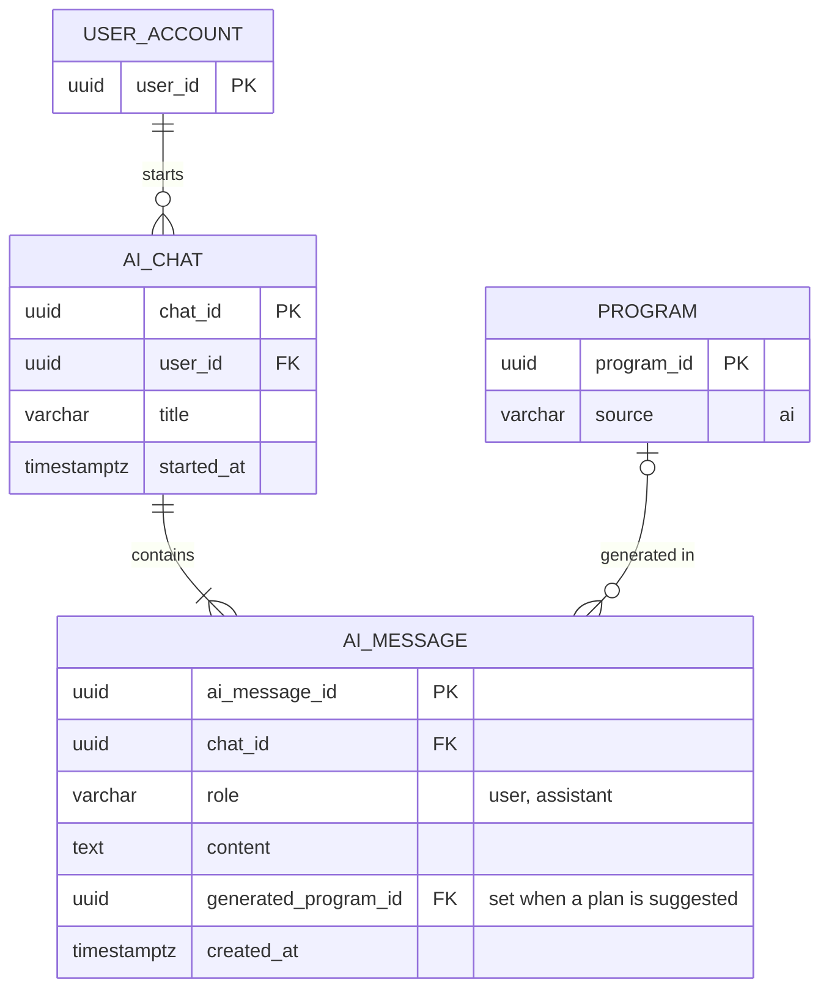

# SwoleMates data model

The team's database design, checked against the app on `feature/user-accounts` (Sep 26, 2026). It uses Supabase: Postgres plus Supabase Auth and Storage.

Interactive version with zoomable diagrams: https://claude.ai/artifact/GAoLFw9mZcUBjpbxxmpCQJ (ask Noor for access).

## What's in Supabase now

These are the tables from `supabase/discover.sql`, `matches.sql` and `profile-photos.sql`. Supabase Auth stores the email and a hashed password in `auth.users`. The profile is saved as JSON in `user_metadata.profile`, with a public copy in `discover_profiles` that has the zip code, coordinates and birthdate removed.

```mermaid
erDiagram
  AUTH_USERS {
    uuid id PK "managed by Supabase Auth"
    varchar email UK
    jsonb user_metadata "profile JSON is saved here"
  }
  DISCOVER_PROFILES {
    uuid id PK, FK "same as auth.users.id"
    jsonb profile "public copy, zip and coordinates removed"
    float8 latitude "private, never sent to others"
    float8 longitude "private, never sent to others"
    timestamptz updated_at
  }
  MATCH_REQUESTS {
    uuid id PK
    uuid from_user_id FK
    uuid to_user_id FK
    text status "pending, accepted, declined"
    timestamptz created_at
  }
  MATCH_MESSAGES {
    uuid id PK
    uuid match_id FK
    uuid sender_id FK
    text body "1 to 1000 characters"
    timestamptz created_at
  }
  PROFILE_PHOTOS_BUCKET {
    text name PK "user_id/file, public read"
    text bucket_id "profile-photos"
  }
  AUTH_USERS ||--o| DISCOVER_PROFILES : "publishes card"
  AUTH_USERS ||--o{ MATCH_REQUESTS : sends
  AUTH_USERS ||--o{ MATCH_REQUESTS : receives
  MATCH_REQUESTS ||--o{ MATCH_MESSAGES : "chat once accepted"
  AUTH_USERS ||--o{ MATCH_MESSAGES : writes
  AUTH_USERS ||--o{ PROFILE_PHOTOS_BUCKET : uploads
```

## Tables to create

Create them in this order. Keep Zub's tables as they are, and create the new ones alongside them. Remove the old profile copies only after the app reads `user_accounts`.

| # | Postgres table | Diagram name | Tab | Action |
|---|---|---|---|---|
| — | `auth.users` | `AUTH_USERS` | Login | Keep. Managed by Supabase. Don't create or change it. |
| — | `match_requests` | `MATCH_REQUEST` | Discover, Chat | Keep. Zub's table, unchanged |
| — | `match_messages` | `MATCH_MESSAGE` | Chat | Keep. Zub's table, unchanged |
| — | `profile-photos` bucket | Storage | Profile | Keep. Photo files stay here. `profile_photos` stores their paths. |
| 1 | `gyms` | `GYM` | Profile, Plans | Create |
| 2 | `user_accounts` | `USER_ACCOUNT` | Profile | Create |
| 3 | `profile_photos` | `PROFILE_PHOTO` | Profile | Create |
| 4 | `profile_prompts` | `PROFILE_PROMPT` | Profile | Create |
| 5 | `user_availability` | `USER_AVAILABILITY` | Profile, Discover | Create |
| 6 | `user_goals` | `USER_GOAL` | Profile | Create |
| 7 | `discover_filters` | `DISCOVER_FILTER` | Discover | Create |
| 8 | `discover_skips` | `DISCOVER_SKIP` | Discover | Create |
| 9 | `blocks` | `BLOCK` | Discover, Chat | Create |
| 10 | `chat_reads` | `CHAT_READ` | Chat | Create |
| 11 | `planned_workouts` | `PLANNED_WORKOUT` | Plans | Create |
| 12 | `workout_attendance` | `ATTENDANCE` | Plans | Create |
| 13 | `workout_logs` | `WORKOUT_LOG` | Dashboard | Create |
| 14 | `nutrition_goals` | `NUTRITION_GOAL` | Dashboard | Create |
| 15 | `daily_nutrition` | `DAILY_NUTRITION` | Dashboard | Create |
| — | `discover_profiles`, `user_metadata.profile` | — | Discover, Profile | Remove later. Only after the app reads `user_accounts`. Until then they keep the app working. |

Every new table needs row-level security, so a user reads and writes only their own rows. Other people's profiles are read only through `discover_people()`, which never returns `birth_date`, `zip_code` or the coordinates.

## Profile, Discover and Chat

Single values go in `USER_ACCOUNT`, and anything a person can have several of gets its own table. Each profile has 1–6 photos and at least 3 prompt answers (max 140 characters each). A lift column set to null means "N/A".

```mermaid
erDiagram
  USER_ACCOUNT {
    uuid user_id PK, FK "auth.users.id"
    varchar full_name "required"
    date birth_date "private, must be 18 or older"
    varchar gender "male, female, other"
    varchar hometown
    varchar zip_code "private, 5 digits"
    float8 latitude "private, center of zip code"
    float8 longitude "private"
    text about "max 280 chars"
    varchar experience_level "beginner, intermediate, advanced, elite"
    uuid home_gym_id FK "optional"
    int bench_lbs "null = N/A, steps of 5"
    int squat_lbs
    int deadlift_lbs
    varchar custom_lift_name
    int custom_lift_lbs
    timestamptz updated_at
  }
  GYM {
    uuid gym_id PK
    varchar osm_id UK "OpenStreetMap place id, e.g. node:123456"
    varchar name
    varchar address UK "picked from the gym search"
    float8 latitude
    float8 longitude
  }
  PROFILE_PHOTO {
    uuid photo_id PK
    uuid user_id FK
    varchar storage_path "user_id/file in profile-photos"
    varchar caption "optional, from the caption list"
    int sort_order "1 to 6, 1 is the main photo"
  }
  PROFILE_PROMPT {
    uuid user_id PK, FK
    varchar prompt PK "from the prompt list"
    varchar answer "1 to 140 chars"
    int sort_order
  }
  USER_AVAILABILITY {
    uuid user_id PK, FK
    varchar day PK "mon to sun"
    varchar time_of_day PK "morning, afternoon, evening"
  }
  USER_GOAL {
    uuid user_id PK, FK
    varchar goal PK "fat loss, endurance, strength training, gain mass"
  }
  DISCOVER_FILTER {
    uuid user_id PK, FK
    int max_distance_miles "default 25, max 50"
    varchar genders "list: male, female; empty = any"
    int min_age "default 18"
    int max_age "default 70"
    varchar experience_levels "list; empty = any"
    boolean match_availability "default false"
  }
  DISCOVER_SKIP {
    uuid user_id PK, FK "who pressed Skip"
    uuid skipped_user_id PK, FK
    timestamptz created_at
  }
  BLOCK {
    uuid blocker_id PK, FK
    uuid blocked_id PK, FK
    timestamptz created_at
  }
  MATCH_REQUEST {
    uuid id PK
    uuid from_user_id FK
    uuid to_user_id FK
    text status "pending, accepted, declined"
    timestamptz created_at
  }
  MATCH_MESSAGE {
    uuid id PK
    uuid match_id FK
    uuid sender_id FK
    text body "1 to 1000 chars"
    timestamptz created_at
  }
  CHAT_READ {
    uuid match_id PK, FK
    uuid user_id PK, FK
    timestamptz last_read_at "drives the Chat tab count"
  }
  GYM |o--o{ USER_ACCOUNT : "home gym of"
  USER_ACCOUNT ||--|{ PROFILE_PHOTO : shows
  USER_ACCOUNT ||--|{ PROFILE_PROMPT : answers
  USER_ACCOUNT ||--o{ USER_AVAILABILITY : "is free"
  USER_ACCOUNT ||--o{ USER_GOAL : has
  USER_ACCOUNT ||--o| DISCOVER_FILTER : sets
  USER_ACCOUNT ||--o{ DISCOVER_SKIP : skips
  USER_ACCOUNT ||--o{ BLOCK : blocks
  USER_ACCOUNT ||--o{ MATCH_REQUEST : sends
  USER_ACCOUNT ||--o{ MATCH_REQUEST : receives
  MATCH_REQUEST ||--o{ MATCH_MESSAGE : contains
  USER_ACCOUNT ||--o{ MATCH_MESSAGE : writes
  MATCH_REQUEST ||--o{ CHAT_READ : "read by"
  USER_ACCOUNT ||--o{ CHAT_READ : reads
```

Constraints:
- No skipping or blocking yourself.
- A block hides both people from each other's Discover and stops messages.
- `min_age` ≤ `max_age`.
- Discover leaves out anyone you've skipped, blocked, requested or matched with.

## Plans and Dashboard

The streak and the calendar are calculated from `WORKOUT_LOG` dates. Personal records come from the lift columns on `USER_ACCOUNT`. Nutrition is one row per day of totals.

```mermaid
erDiagram
  USER_ACCOUNT {
    uuid user_id PK
  }
  MATCH_REQUEST {
    uuid id PK "accepted matches only"
  }
  GYM {
    uuid gym_id PK
  }
  PLANNED_WORKOUT {
    uuid planned_workout_id PK
    uuid match_id FK
    uuid created_by FK
    uuid gym_id FK
    varchar title "e.g. Push with Marcus"
    date workout_date "within the next 14 days"
    time start_time
    varchar focus "push, pull, legs, upper, full body, cardio"
    text notes
    varchar status "scheduled, completed, cancelled"
    timestamptz created_at
  }
  ATTENDANCE {
    uuid planned_workout_id PK, FK
    uuid user_id PK, FK
    boolean attended
    timestamptz checked_in_at
  }
  WORKOUT_LOG {
    uuid log_id PK
    uuid user_id FK
    uuid planned_workout_id FK "set when it came from a plan"
    date workout_date
    varchar title
    text notes
    boolean verified "true only from a completed plan"
    timestamptz created_at
  }
  NUTRITION_GOAL {
    uuid user_id PK, FK
    int calorie_goal
    int protein_goal_g
    int carb_goal_g
    int fat_goal_g
    timestamptz updated_at
  }
  DAILY_NUTRITION {
    uuid user_id PK, FK
    date log_date PK
    int calories
    int protein_g
    int carbs_g
    int fat_g
  }
  MATCH_REQUEST ||--o{ PLANNED_WORKOUT : schedules
  USER_ACCOUNT ||--o{ PLANNED_WORKOUT : creates
  GYM |o--o{ PLANNED_WORKOUT : "held at"
  PLANNED_WORKOUT ||--|{ ATTENDANCE : tracks
  USER_ACCOUNT ||--o{ ATTENDANCE : "checks in"
  USER_ACCOUNT ||--o{ WORKOUT_LOG : records
  PLANNED_WORKOUT |o--o{ WORKOUT_LOG : "logged as"
  USER_ACCOUNT ||--o| NUTRITION_GOAL : sets
  USER_ACCOUNT ||--o{ DAILY_NUTRITION : logs
```

## Later: gyms and events (no screens yet)

```mermaid
erDiagram
  USER_ACCOUNT {
    uuid user_id PK
    uuid home_gym_id FK
  }
  GYM {
    uuid gym_id PK
    uuid admin_user_id FK
    varchar name
    varchar address
    varchar phone
    varchar website
    text description
    text equipment_summary
    text amenities
  }
  GYM_HOURS {
    uuid gym_id PK, FK
    int day_of_week PK "0 = Sunday"
    time open_time
    time close_time
  }
  GYM_EVENT {
    uuid event_id PK
    uuid gym_id FK
    uuid workout_type_id FK
    uuid instructor_trainer_id FK
    varchar title
    text description
    varchar event_kind "class, event, competition"
    timestamptz start_time
    timestamptz end_time
    int capacity
    boolean members_only
    varchar recurrence "null, weekly, daily"
    varchar status "scheduled, cancelled, completed"
  }
  EVENT_RSVP {
    uuid rsvp_id PK
    uuid event_id FK
    uuid user_id FK
    varchar status "going, waitlisted, cancelled, attended, no_show"
    int waitlist_position
    timestamptz rsvp_at
  }
  USER_ACCOUNT ||--o{ GYM : administers
  GYM |o--o{ USER_ACCOUNT : "home gym of"
  GYM ||--o{ GYM_HOURS : "open during"
  GYM ||--o{ GYM_EVENT : hosts
  GYM_EVENT ||--o{ EVENT_RSVP : receives
  USER_ACCOUNT ||--o{ EVENT_RSVP : makes
```

## Later: trainers and programs (no screens yet)

```mermaid
erDiagram
  USER_ACCOUNT {
    uuid user_id PK
  }
  TRAINER_PROFILE {
    uuid trainer_id PK
    uuid user_id FK, UK
    uuid gym_id FK "null if independent"
    varchar headline
    text bio
    text certifications
    text specialties
    int years_experience
    decimal session_rate
    int max_clients
    varchar social_handle
  }
  PROGRAM {
    uuid program_id PK
    uuid author_trainer_id FK "null for AI or personal plans"
    uuid owner_user_id FK "set for AI or personal plans"
    varchar source "trainer, ai, user"
    varchar program_type "program, split, single_workout"
    varchar title
    text description
    varchar difficulty
    int duration_weeks
    int days_per_week
    varchar visibility "public, private"
    timestamptz created_at
  }
  PROGRAM_EXERCISE {
    uuid program_exercise_id PK
    uuid program_id FK
    uuid exercise_id FK
    int week_number
    int day_number
    int sort_order
    int sets
    varchar reps "e.g. 8-12"
    int rest_sec
    text notes
  }
  SAVED_PROGRAM {
    uuid user_id PK, FK
    uuid program_id PK, FK
    timestamptz saved_at
    date started_on
    boolean is_active
  }
  CLIENT_REQUEST {
    uuid request_id PK
    uuid user_id FK
    uuid trainer_id FK
    text goal_summary
    varchar preferred_schedule
    text message
    varchar status "pending, accepted, declined, withdrawn"
    timestamptz requested_at
    timestamptz responded_at
  }
  TRAINING_SESSION {
    uuid session_id PK
    uuid trainer_id FK
    uuid client_user_id FK
    uuid request_id FK
    uuid gym_id FK
    timestamptz start_time
    timestamptz end_time
    varchar status "scheduled, completed, cancelled"
    text trainer_notes
  }
  EXERCISE {
    uuid exercise_id PK
  }
  USER_ACCOUNT ||--o| TRAINER_PROFILE : "is a"
  TRAINER_PROFILE |o--o{ PROGRAM : authors
  USER_ACCOUNT |o--o{ PROGRAM : owns
  PROGRAM ||--|{ PROGRAM_EXERCISE : includes
  EXERCISE ||--o{ PROGRAM_EXERCISE : "used in"
  USER_ACCOUNT ||--o{ SAVED_PROGRAM : saves
  PROGRAM ||--o{ SAVED_PROGRAM : "saved as"
  USER_ACCOUNT ||--o{ CLIENT_REQUEST : sends
  TRAINER_PROFILE ||--o{ CLIENT_REQUEST : receives
  CLIENT_REQUEST |o--o{ TRAINING_SESSION : "leads to"
  TRAINER_PROFILE ||--o{ TRAINING_SESSION : leads
  USER_ACCOUNT ||--o{ TRAINING_SESSION : attends
```

## Later: AI chatbot (no screens yet)

```mermaid
erDiagram
  USER_ACCOUNT {
    uuid user_id PK
  }
  AI_CHAT {
    uuid chat_id PK
    uuid user_id FK
    varchar title
    timestamptz started_at
  }
  AI_MESSAGE {
    uuid ai_message_id PK
    uuid chat_id FK
    varchar role "user, assistant"
    text content
    uuid generated_program_id FK "set when a plan is suggested"
    timestamptz created_at
  }
  PROGRAM {
    uuid program_id PK
    varchar source "ai"
  }
  USER_ACCOUNT ||--o{ AI_CHAT : starts
  AI_CHAT ||--|{ AI_MESSAGE : contains
  PROGRAM |o--o{ AI_MESSAGE : "generated in"
```

## Decisions

- **Profile tables (decided: full split).** The profile moves out of JSON into `USER_ACCOUNT` and its child tables, which replaces both copies saved today. Zub's `src/lib/profile.ts` and `src/lib/discover.ts` have to switch over before the old copies are removed.
- **Birthdate instead of age (decided).** Age is calculated from `birth_date`. Other users see only the age.
- **Gyms (decided: a table).** Profiles and planned workouts both point to `gyms`.
- **Unmatching (open).** `match_requests` has no "unmatched" status, and the app only has Block.
- **Group workouts (open).** Matching is 1-to-1. Groups would need a member table.
